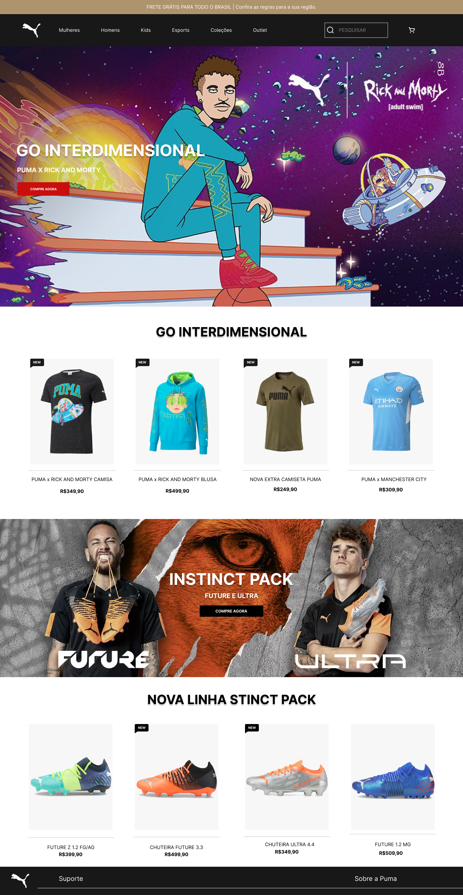

# Puma

Projeto desenvolvido durante o curso do SENAI Jandira nas aulas de LIMA, inspirado no site da [PUMA](https://br.puma.com/?utm_source=GGL&utm_medium=BS&gclid=EAIaIQobChMIp4jzmc-x9wIVzm1vBB22xgqlEAAYASAAEgLfrvD_BwE).

---

---

## Qual era o objetivo do projeto?
O objetivo era criar um lading page com base no design feito no figma, aprendendo e melhorando a estrutura do HTML, CSS e conceitos de responsividade.

---

## O que é lading page?
Lading Pages são páginas com foco principal na conversão de visitantes, assim, essas páginas possuem uma estética mais minimalista comparada aos outros sites.

---

## Tecnologias utilizadas:
- HTML 5
- CSS 3
- JavaScript
- Figma

---

## Links
- [Resultado](https://leobarbosass.github.io/puma/)
- [Figma](https://www.figma.com/file/HyKGjTdM1k9VUVvfRhPKDQ/Untitled?node-id=2%3A2)
- [Codigo](./index.html)
- [Github](https://github.com/leobarbosass/puma)
- [Autor](https://github.com/leobarbosass)